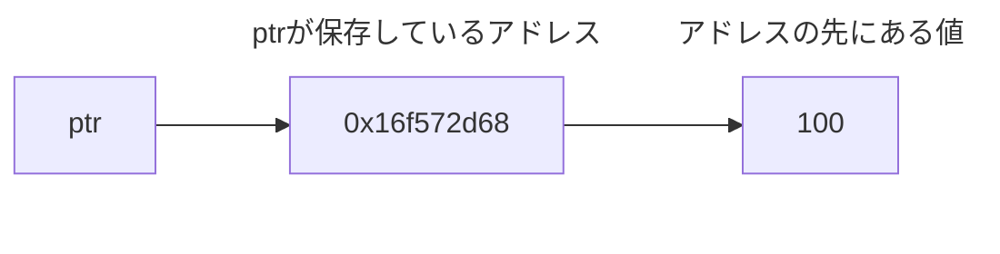

# C言語の壁を越えよう！
## ～メモリの世界から理解するC言語～

#6 C言語最大の壁「ポインタ」まずは正体を知ろう

---

## この動画について

📺 **[動画はこちら](https://youtu.be/Md3QmBft3w0)**

C言語最大の壁とも言われる「ポインタ」。でも、最初に理解することは意外とシンプルです。

この動画では、ポインタの正体を「アドレスを保存する変数」という視点から、実際のコードとメモリダンプを使って分かりやすく解説します。

`&` と `*` の役割や、`num`・`&num`・`ptr`・`*ptr` の違いを一つずつ確認しながら、メモリの世界からポインタの基本を理解していきましょう。

実際にコンパイルして動かしながら学習すると、理解がさらに深まります。


---

## この動画で学べること

- ポインタとは何か
- ポインタがアドレスを保存する仕組み
- `&` と `*` の基本的な役割
- ポインタと変数の関係
- メモリの視点からポインタを理解する考え方


---

## サンプルコード

この動画で使用したサンプルコードです。

- [pointer_basic.c](pointer_basic.c)
- [mdump.h](../mdump.h)
- [mdump.c](../mdump.c)

---
## 目次

- 今日のサンプルプログラム
- まずは実行してみよう
- `num`とは？
- `&num`とは？
- ポインタ変数 `ptr`
- `*ptr`とは？
- メモリダンプを見てみよう
- `ptr`自身もメモリを持っている
- アドレスもリトルエンディアンで保存される
- 2つのアドレスを整理しよう
- `num`、`&num`、`ptr`、`*ptr`を整理しよう
- まとめ

---
## 動画シナリオ

今回は、C言語最大の壁とも言われる「ポインタ」について学びます。

ポインタは難しいと思われがちですが、最初に覚えることはたった一つです。

ポインタは、アドレスを保存する変数です。

今日は、この意味をメモリを見ながら理解していきましょう。


### 今日のサンプルプログラム

今回使用するサンプルコードです。

今回も、これまでの動画で使用してきた

`mdump.c` と `mdump.h` を共通ライブラリとして利用します。

ぜひ実際に動かしながら学習してみてください。

#### pointer_basic.c
```c
#include <stdio.h>
#include "../mdump.h"

int main(void)
{
    int num = 100;
    int *ptr = &num;

    printf("num  = %d\n", num);
    printf("&num = %p\n", (void *)&num);
    printf("ptr  = %p\n", (void *)ptr);
    printf("*ptr = %d\n", *ptr);

    printf("\n--- Memory Dump ---\n");

    mdump(&num, sizeof(num));
    mdump(&ptr, sizeof(ptr));

    return 0;
}
```

今日は、このプログラムが何をしているのかを、一つずつ理解していきます。


### まずは実行してみよう


まずはコンパイルします。
```bash
clang pointer_basic.c ../mdump.c -o pointer_basic
```

続いて実行します。
```bash
./pointer_basic
```

【実行結果】
```text
num  = 100
&num = 0x16f572d68
ptr  = 0x16f572d68
*ptr = 100

--- Memory Dump ---
0x16f572d68 : 64 00 00 00
0x16f572d60 : 68 2D 57 6F 01 00 00 00
```

アドレスは実行環境や実行するタイミングによって変わります。

そのため、皆さんの環境では、違うアドレスが表示されると思います。

今日は、この実行結果が何を表しているのかを一つずつ確認していきます。


### `num`とは？

まずはこちらです。

```c
int num = 100;
```

これは普通の変数です。

`num`には、整数の`100`が保存されています。

実行結果でも、
```text
num  = 100
```
と表示されています。

メモリダンプでは、次のようになっていました。

```text
0x16f572d68 : 64 00 00 00                                      d...
```

10進数の`100`は、16進数では`64`です。

この環境では`int`が4バイトなので、`64 00 00 00` という4バイトで保存されています。


### `&num`とは？

次はこちらです。

```c
&num
```

`&`は、変数が保存されているアドレスを取得する演算子です。

実行結果では、

```text
&num = 0x16f572d68
```

となっています。

つまり、この実行では`num`が `0x16f572d68` というアドレスに置かれています。

整理すると、下記のような状態です。

| アドレス | 保存されている値 |
| :----------: | :---------: |
| 0x16f572d68 | 100 |


### ポインタ変数 `ptr`

続いて、今回の中心となるコードです。

```c
int *ptr = &num;
```

これは、int型の変数のアドレスを保存するポインタ変数 `ptr` を宣言しています。

`&num`を`ptr`へ代入しています。

`&num`は、`num`のアドレスでした。


そのため、`ptr`に保存されるのは`100`ではありません。

`ptr`には、`num`のアドレスである`0x16f572d68`が保存されます。

実行結果を比べてみると、同じアドレスになっています。

```text
&num = 0x16f572d68
ptr  = 0x16f572d68
```

これは、`ptr`の中に`num`のアドレスが保存されているからです。

つまり、**ポインタは、アドレスを保存する変数**ということです。

### `*ptr`とは？

次はこちらです。

```c
*ptr
```

`ptr`には、`num`のアドレスが入っています。

`*ptr`は、`ptr`に保存されているアドレスへ行き、その場所にある値を取り出すという意味です。


イメージすると、次のようになります。



そのため、実行結果は、`*ptr = 100` になります。

`ptr`はアドレスを表し、`*ptr`は、そのアドレスの先にある値を表します。


### メモリダンプを見てみよう

それでは、今回の重要なポイントであるメモリダンプを詳しく見てみましょう。

今回の結果は、次のようになりました。

```text
--- Memory Dump ---
0x16f572d68 : 64 00 00 00
0x16f572d60 : 68 2D 57 6F 01 00 00 00
```


最初の行は、`num`のメモリです。

```text
0x16f572d68 : 64 00 00 00
```

`num`には`100`が保存されています。

`100`を16進数にすると`64`なので、`64 00 00 00`となっています。

以前のエンディアンの動画では、整数がリトルエンディアンで保存されることを確認しました。


### `ptr`自身もメモリを持っている


次の行は、`ptr`自身のメモリです。

```text
0x16f572d60 : 68 2D 57 6F 01 00 00 00
```

ここで重要なのは、ポインタ変数`ptr`自身も、普通の変数と同じようにメモリ上に置かれていることです。

今回、`ptr`自身が置かれているアドレスは、`0x16f572d60`です。

そして、その場所には、`68 2D 57 6F 01 00 00 00`という8バイトが保存されています。

このMacの環境では、ポインタのサイズは8バイトです。

では、この8バイトは何を表しているのでしょうか。


### アドレスもリトルエンディアンで保存される

`ptr`に保存されている値は、`0x16f572d68`でした。

```text
--- Memory Dump ---
0x16f572d68 : 64 00 00 00
0x16f572d60 : 68 2D 57 6F 01 00 00 00
```

8バイトの値として桁をそろえると、`0x000000016F572D68`です。

これを1バイトずつ区切ると、`00 00 00 01 6F 57 2D 68`となります。

しかし、メモリダンプでは、`68 2D 57 6F 01 00 00 00 `という逆の順番で並んでいます。

これは、このMacがリトルエンディアンを使用しているからです。

リトルエンディアンでは、値の下位バイトからメモリに保存されます。

そのため、`0x000000016F572D68`というアドレスが、

メモリ上では、`68 2D 57 6F 01 00 00 00`という順番で保存されています。

実は、ポインタが持つアドレスも、コンピュータから見れば数値です。

そのため、アドレスも同じようにリトルエンディアンで保存されます。


### 2つのアドレスを整理しよう

ここで、アドレスが2種類出てきたので整理します。

```text
--- Memory Dump ---
0x16f572d68 : 64 00 00 00
0x16f572d60 : 68 2D 57 6F 01 00 00 00
```

```text
&num
0x16f572d68
```
これは、`num`が置かれているアドレスです。


そして、
```text
&ptr
0x16f572d60
```
これは、ポインタ変数`ptr`自身が置かれているアドレスです。

ポインタも普通の変数なので、`ptr`自身にもメモリ領域があります。

そのメモリの中には、`num`のアドレスが保存されています。


図にすると、このようになります。

```text
アドレス                 保存されている値

┌──────────────┐   ┌──────────────┐
│  0x16f572d60 │ → │  0x16f572d68 │
└──────────────┘   └──────────────┘
     (ptr)            (numのアドレス)

┌──────────────┐   ┌──────────────┐
│  0x16f572d68 │ → │    100       │
└──────────────┘   └──────────────┘
     (num)
```

この図を見ると、

まず、`ptr`は`0x16f572d68`という値を持っています。

この値は、`num`のアドレスです。

さらに、そのアドレスへ行くと、

そこには `100`が保存されています。

つまり、

**`ptr`は`100`を持っているのではありません。**

**`100`が保存されている場所を持っています。**

これが、**ポインタはアドレスを保存する変数**と言われる理由です。


### `num`、`&num`、`ptr`、`*ptr`を整理しよう

最後に、今回登場した4つを整理します。

- `num`
  - `num`に保存されている値です。
  - 今回の場合は`100`です。
- `&num`
  - `num`が保存されているアドレスです。
  - 今回の実行では`0x16f572d68`です。
- `ptr`
  - ポインタ変数`ptr`に保存されている値です。
  - `ptr`には`num`のアドレスが入っているため、`&num`と同じ`0x16f572d68`になります。
- `*ptr`
  - `ptr`に保存されているアドレスの先にある値です。
  - その場所には`num`があるため、`100`になります。


### まとめ

今回は、C言語最大の壁とも言われるポインタの正体を見てきました。

今回覚えてほしいことは、次の4つです。

- 普通の変数には値が入る
- `&`を使うと変数のアドレスを取得できる
- ポインタにはアドレスが入る
- `*`を使うと、そのアドレスの先にある値を取得できる

そして、メモリダンプから、

- ポインタ自身もメモリ上に存在する
- ポインタにはアドレスが数値として保存されている
- アドレスもリトルエンディアンで保存される

ということも確認できました。

つまり、
**ポインタは、アドレスを保存する変数です。**

まずは、この正体を理解できれば大丈夫です。